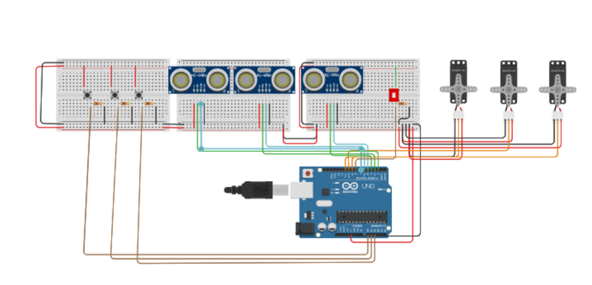
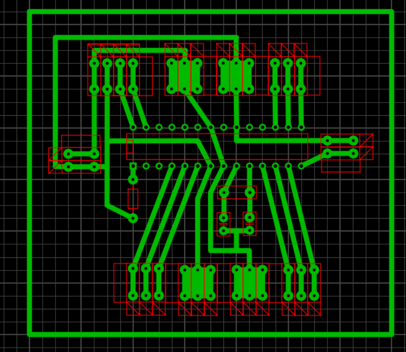

# Arduino-actions

# Nome do projeto
mecanismo para auxiliar as pessoas com a toma dos medicamentos. 

## Hardware Necessario

* Arduino Board
* Servo Motor
* Sensor de Movimento 
* Modulo de horas arduino 
* interruptor de Chave 

## Circuito

Breve descricao do circuito com imagem.

## Esquema

